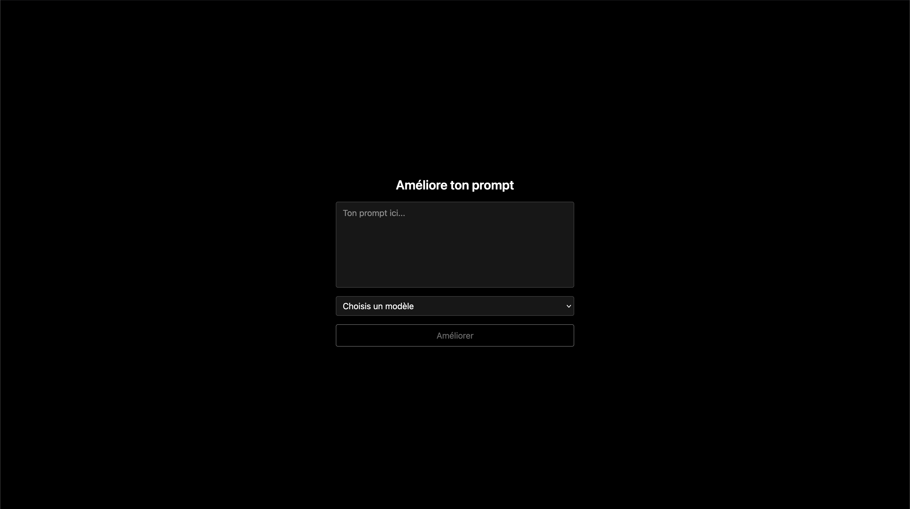

# 🧠 Prompt Optimizer

Une application web pour améliorer automatiquement des prompts d'IA (GPT, Claude, Gemini…), avec la possibilité de poser des questions complémentaires si le prompt est trop vague. Le projet à pour but de prendre en main vue.js et Spring Boot, tout en intégrant l'API OpenAI.

---

## 🚀 Fonctionnalités

- 🔍 Analyse de prompts utilisateur pour vérifier s'ils sont suffisamment clairs
- ✨ Optimisation automatique des prompts selon le modèle choisi (GPT-3.5, GPT-4, Claude 3, Gemini…)
- ❓ Génération de questions complémentaires si des précisions sont nécessaires
- 📦 Frontend en Vue.js + Tailwind CSS
- 🧩 Backend en Spring Boot (Java) + API OpenAI

---

## 📸 Aperçu



---

## 🧰 Technologies utilisées

### Frontend
- [Vue.js 3](https://vuejs.org/)
- [Tailwind CSS](https://tailwindcss.com/)
- [Axios](https://axios-http.com/)

### Backend
- [Spring Boot](https://spring.io/projects/spring-boot)
- [OpenAI API](https://platform.openai.com/docs)

---

## ⚙️ Configuration

### Backend

1. Cloner le repo :

```bash
git clone https://github.com/adrienfrsn/prompt-optimizer.git
cd prompt-optimizer/backend
```

2. Configurer les clés API dans `application.yml` :

```yaml
openai:
    api:
        key: "sk-..."
        model: gpt-3.5-turbo
        maxTokens: 1000
```

3. Lancer le backend :

```bash
mvn spring-boot:run
```

Par défaut, l'API tourne sur http://localhost:8080

### Frontend

1. Aller dans le dossier frontend :

```bash
cd ../frontend
```

2. Installer les dépendances :

```bash
npm install
```

3. Lancer le serveur de développement :

```bash
npm run dev
```

L'interface est accessible sur http://localhost:5173 (ou autre port Vite)

---

## 📄 TODO / Améliorations à venir

- Authentification utilisateur (Spring Security + JWT)
- Historique des prompts
- UI plus poussée avec animations
- Déploiement
