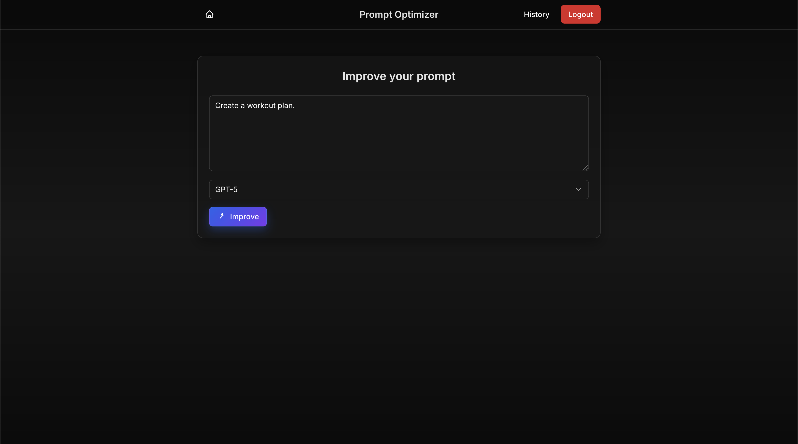
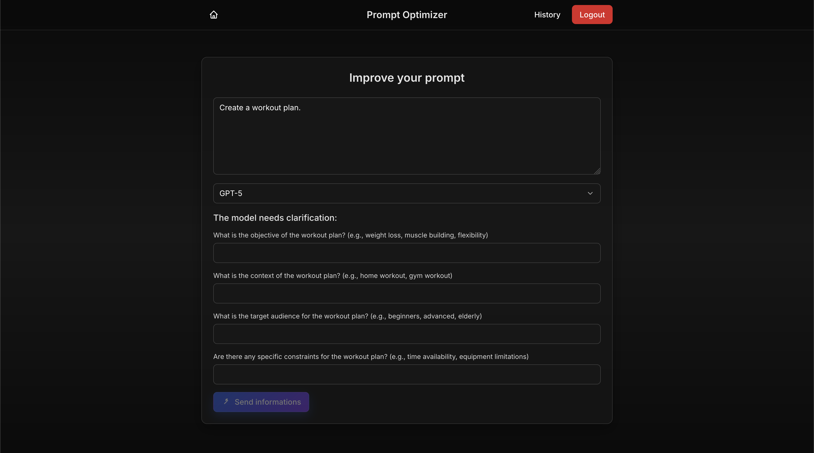
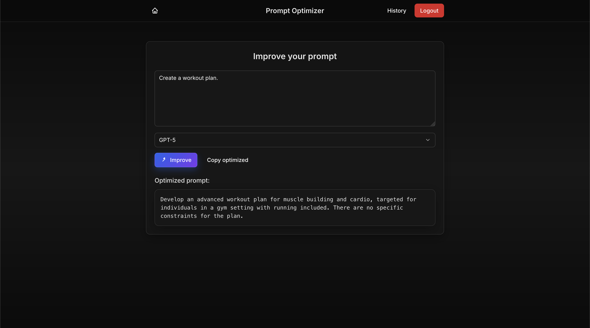

# Prompt Optimizer

A web application that automatically improves AI prompts (for GPT, Claude, Gemini, etc.) and asks follow-up questions when the prompt is too vague.  
This project was created to get hands-on experience with Vue.js and Spring Boot, while integrating the OpenAI API.

---

## Features

- Analyze user prompts to check if they're clear enough
- Automatically optimize prompts based on the selected model (GPT-3.5, GPT-4, Claude 3, Gemini…)
- Generate clarifying questions when needed
- Frontend built with Vue.js + Tailwind CSS
- Backend using Spring Boot (Java) + OpenAI API
- User registration and login system

---

## Preview





---

## Tech Stack

### Frontend
- [Vue.js 3](https://vuejs.org/)
- [Tailwind CSS](https://tailwindcss.com/)
- [Axios](https://axios-http.com/)

### Backend
- [Spring Boot](https://spring.io/projects/spring-boot)
- [OpenAI API](https://platform.openai.com/docs)

---

## Setup & Configuration

### Backend

1. Clone the repository:

```bash
git clone https://github.com/adrienfrsn/prompt-optimizer.git
cd prompt-optimizer/backend
```

2. Copy the configuration template and fill in your credentials:

```bash
cp src/main/resources/application.yml.example src/main/resources/application.yml
```

Then edit application.yml to include your database details and OpenAI API key.

3. Run the backend:

```bash
mvn spring-boot:run
```

By default, the backend runs on http://localhost:8080

### Frontend

1. Go to the frontend directory:

```bash
cd ../frontend
```

2. Install dependencies:

```bash
npm install
```

3. Start the development server:

```bash
npm run dev
```

The app should be accessible at http://localhost:5173 (or another Vite port)

---

## TODO / Upcoming Improvements

- Prompt history
- Improved UI with animations
- Deployment